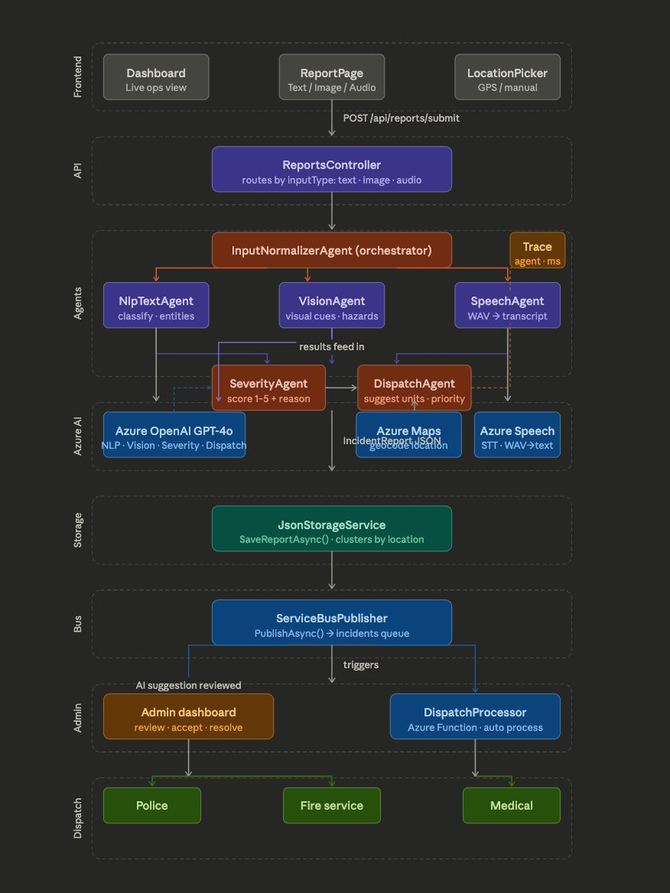
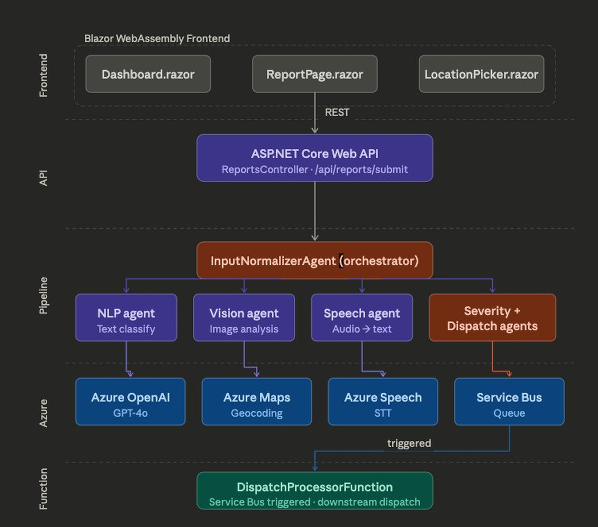
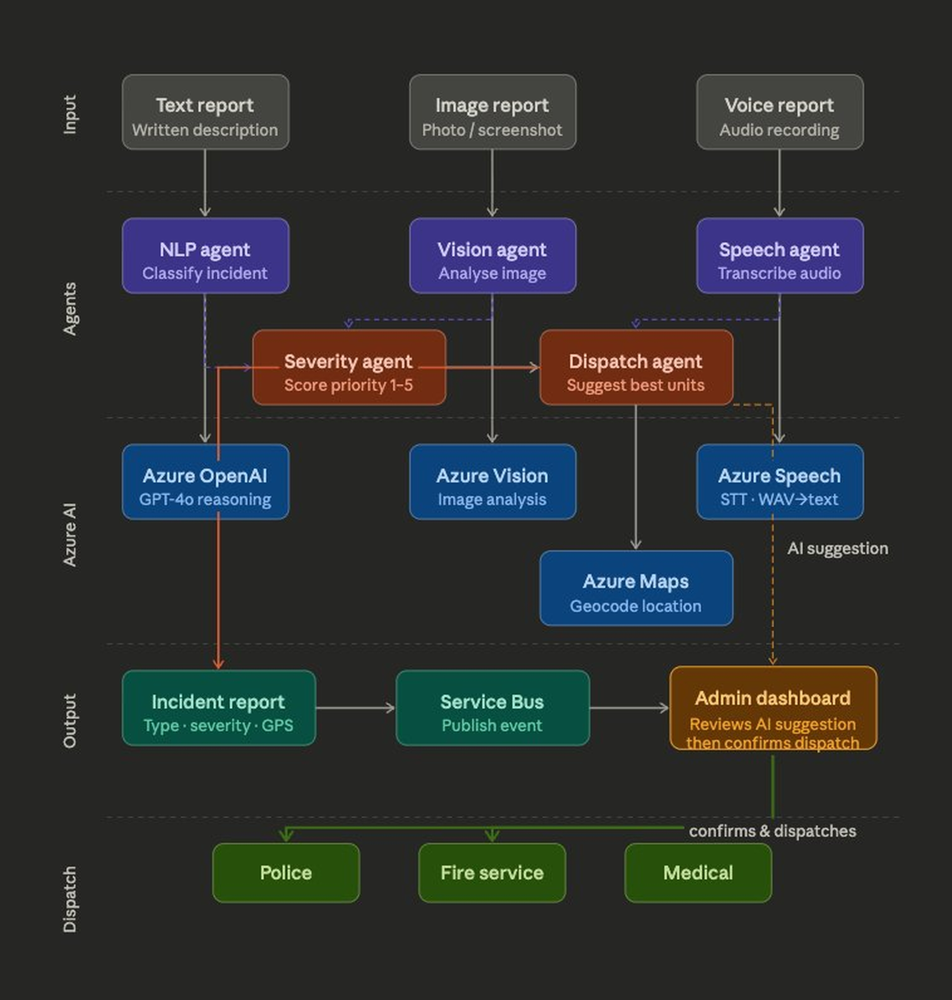
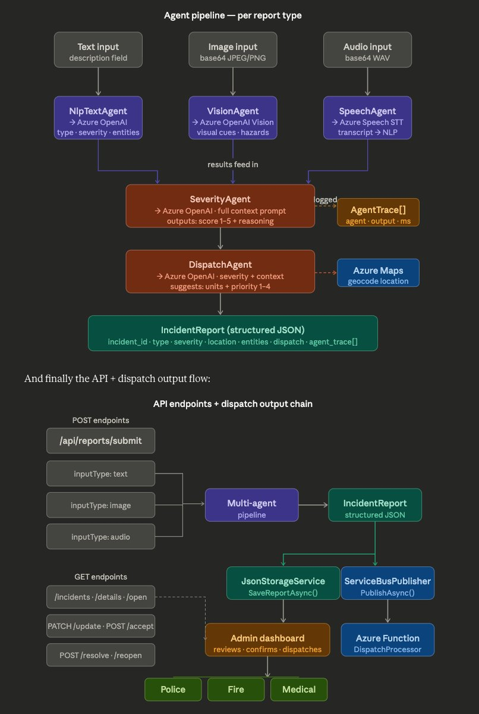
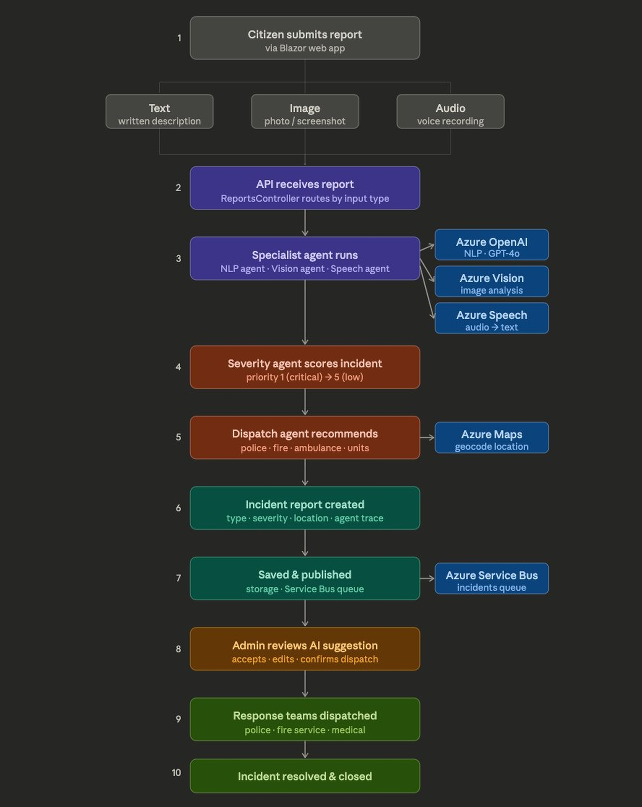

# 🚨 AI Smart City Emergency Coordination Platform

> **Multi-agent AI system for real-time emergency detection, severity classification, and human-confirmed intelligent dispatch.**

Built for the **Microsoft AI Dev Days Hackathon** — an end-to-end AI pipeline that receives emergency reports in any format, classifies the incident, scores severity, and recommends dispatch — with human oversight at every critical decision.

[](https://azure.microsoft.com/en-us/products/ai-services/openai-service)
[](https://azure.microsoft.com/en-us/products/ai-services/ai-speech)
[](https://azure.microsoft.com/en-us/products/azure-maps)
[](https://azure.microsoft.com/en-us/products/service-bus)
[](https://dotnet.microsoft.com/en-us/apps/aspnet/web-apps/blazor)
[](https://dotnet.microsoft.com)

---

## 📸 Screenshots

### Login Page


### Submit Incident Report — Text


### Submit Incident Report — Image


### Admin Dashboard — Live Incident Management


---

## 🗺 System Diagrams

### 1. Workflow Overview
> End-to-end emergency response pipeline — from citizen report to incident resolution in 10 automated steps using multi-agent AI and Azure services.



---

### 2. System Architecture
> Full system architecture — Blazor WebAssembly frontend communicates with ASP.NET Core API, which orchestrates a multi-agent pipeline backed by Azure OpenAI, Azure Maps, Azure Speech, and Azure Service Bus.



---

### 3. Architecture Layers
> Multi-layer agent architecture — three specialist AI agents (NLP, Vision, Speech) process input in parallel, feeding into Severity and Dispatch agents that produce a structured incident report with full audit trace.



---

### 4. Agent Pipeline Detail
> Agent pipeline detail and API endpoint structure — shows how each input type flows through dedicated AI agents, how results converge into a scored IncidentReport JSON, and how the REST API routes reports to storage, Service Bus, and admin dispatch.



---

### 5. Complete System Flow
> Complete system flow — all layers from Blazor frontend through the agent pipeline, Azure AI services, storage, Service Bus queue, Azure Function, and admin-confirmed dispatch to Police, Fire, and Medical response teams.



---

## 🧠 The Problem

Modern cities face a critical challenge — emergency response systems still rely on manual complaint routing, fragmented communication, and delayed decision-making. Every second lost in coordination costs lives.

This platform addresses that gap by deploying a multi-agent AI pipeline that processes emergency reports in any format — text descriptions, images, or voice recordings — and automatically classifies the incident, scores its severity, and recommends the most appropriate response units, all within seconds.

Crucially, the platform keeps a **human in the loop**. The AI recommends — the admin decides. Emergency coordinators review the AI-generated incident report, verify the suggested response units, and confirm dispatch through a live dashboard. This ensures responsible AI deployment in a life-critical environment where accountability matters.

---

## ✅ Hackathon Checklist

- [x] Multi-modal input — text, image, audio
- [x] Multi-agent pipeline with full audit trace
- [x] Structured JSON output with incident_id, type, severity, location, entities, dispatch
- [x] Azure OpenAI GPT-4o — NLP, Vision, Severity, Dispatch reasoning
- [x] Azure AI Speech — audio transcription (WAV → text)
- [x] Azure Computer Vision — image analysis
- [x] Azure Maps — location geocoding
- [x] Azure Service Bus — async incident event queue
- [x] Azure Functions — Service Bus triggered dispatch processor
- [x] Blazor WebAssembly frontend — text, image, audio report submission
- [x] Admin dashboard — live incident management with confirm, resolve, reopen
- [x] Human-in-the-loop — AI suggests, admin confirms
- [x] Responsible AI — full agent trace logged for every decision
- [x] One-command Azure Bicep deployment
- [x] Swagger API documentation

---

## 📁 Project Structure

```
EmergencyPlatform/
├── EmergencyPlatform.sln
├── Backend/
│   ├── Controllers/
│   │   └── ReportsController.cs         ← REST endpoints
│   ├── Agents/
│   │   ├── InputNormalizerAgent.cs      ← Pipeline orchestrator
│   │   ├── NlpTextAgent.cs              ← Text classification
│   │   ├── VisionAgent.cs               ← GPT-4o vision analysis
│   │   ├── SeverityAgent.cs             ← Severity scoring
│   │   └── DispatchAgent.cs             ← Unit dispatch logic
│   ├── Services/
│   │   ├── AzureOpenAIService.cs        ← OpenAI REST wrapper
│   │   ├── AzureSpeechService.cs        ← Speech-to-text (WAV)
│   │   ├── AzureMapsService.cs          ← Geocoding
│   │   └── ServiceBusPublisher.cs       ← Message publishing
│   ├── Models/
│   │   └── IncidentReport.cs            ← All domain models
│   └── Functions/
│       └── DispatchProcessorFunction.cs ← Azure Function trigger
├── Frontend/
│   ├── Pages/
│   │   ├── Dashboard.razor              ← Live admin ops center
│   │   └── Report.razor                 ← Multi-modal input
│   ├── Components/
│   │   ├── IncidentResultCard.razor     ← Result display
│   │   └── LocationRow.razor            ← GPS / manual location
│   └── wwwroot/
│       └── audioRecorder.js             ← Browser audio → WAV
├── Infrastructure/
│   └── main.bicep                       ← Azure IaC deployment
└── docs/
    ├── screenshots/                     ← App screenshots
    └── diagrams/                        ← Architecture diagrams
```

---

## 🚀 Quick Start

### Prerequisites
- .NET 8 SDK
- Azure subscription with:
  - Azure OpenAI (GPT-4o deployment)
  - Azure AI Speech
  - Azure Computer Vision
  - Azure Maps
  - Azure Service Bus

### 1. Configure Azure Keys

Edit `Backend/appsettings.json`:

```json
{
  "AzureOpenAI": {
    "Endpoint": "https://YOUR_RESOURCE.openai.azure.com",
    "ApiKey": "YOUR_KEY",
    "DeploymentName": "gpt-4o"
  },
  "AzureSpeech": {
    "ApiKey": "YOUR_KEY",
    "Region": "eastus"
  },
  "AzureMaps": {
    "SubscriptionKey": "YOUR_KEY"
  },
  "ServiceBus": {
    "ConnectionString": "Endpoint=sb://...",
    "QueueName": "incidents"
  }
}
```

### 2. Run the Backend

```bash
cd Backend
dotnet run
# API: https://localhost:5001
# Swagger: https://localhost:5001/swagger
```

### 3. Run the Frontend

```bash
cd Frontend
dotnet run
# Blazor app: https://localhost:5002
```

### 4. Deploy to Azure

```bash
az group create --name emergency-ai-rg --location eastus

az deployment group create \
  --resource-group emergency-ai-rg \
  --template-file Infrastructure/main.bicep

cd Backend
dotnet publish -c Release
az webapp deploy --resource-group emergency-ai-rg \
  --name emergency-ai-api \
  --src-path bin/Release/net8.0/publish
```

---

## 📡 API Reference

### POST /api/reports/submit — Text
```json
{
  "inputType": "text",
  "description": "A truck is on fire on the motorway, blocking two lanes.",
  "lat": 40.7128,
  "lon": -74.0060
}
```

### POST /api/reports/submit — Image
```json
{
  "inputType": "image",
  "base64Image": "<base64 JPEG>",
  "mimeType": "image/jpeg",
  "lat": 40.7128,
  "lon": -74.0060
}
```

### POST /api/reports/submit — Audio
```json
{
  "inputType": "audio",
  "base64Audio": "<base64 WAV>",
  "mimeType": "audio/wav"
}
```

### Admin Endpoints
```
GET    /api/reports/incidents                    ← list all incidents
GET    /api/reports/incidents/{key}/details      ← full incident detail
PATCH  /api/reports/incidents/{key}/update       ← edit type / severity
POST   /api/reports/incidents/{key}/accept       ← confirm dispatch
POST   /api/reports/incidents/{key}/resolve      ← mark resolved
POST   /api/reports/incidents/{key}/reopen       ← reopen incident
POST   /api/reports/mark-duplicate               ← merge duplicate reports
```

---

## 📤 Example Output

```json
{
  "incident_id": "03681D90",
  "input_type": "text",
  "incident_type": "fire",
  "severity_level": "high",
  "location_data": {
    "lat": 39.2440,
    "lon": 22.7305,
    "inferred_location_description": "motorway"
  },
  "entities": {
    "people_involved": 1,
    "vehicles_involved": 1,
    "hazards": "flames, spreading fire, smoke"
  },
  "reasoning_summary": "Active vehicle fire on motorway spreading to nearby bushes. Driver evacuated safely. High severity due to fire spread risk.",
  "dispatch_recommendation": {
    "units_required": ["fire", "ambulance", "traffic_police"],
    "priority": 2
  },
  "timestamp": "2026-03-15T17:21:00Z",
  "agent_trace": [
    { "agent": "NlpTextAgent",  "output": "type=fire, severity=high", "duration_ms": 834 },
    { "agent": "SeverityAgent", "output": "severity=high, priority=2", "duration_ms": 312 },
    { "agent": "DispatchAgent", "output": "units=[fire,ambulance,traffic_police]", "duration_ms": 278 }
  ]
}
```

---

## ☁️ Azure Services Used

| Service | Usage |
|---|---|
| Azure OpenAI GPT-4o | NLP classification · Vision analysis · Severity scoring · Dispatch reasoning |
| Azure AI Speech | Audio → text transcription (WAV, 16kHz mono) |
| Azure Computer Vision | Image-based incident scene analysis |
| Azure Maps | Geocoding location descriptions to lat/lon coordinates |
| Azure Service Bus | Async incident event queue for downstream dispatch systems |
| Azure Functions | Service Bus triggered dispatch processor |
| Azure App Service | Host backend API + Blazor frontend |

---

## 🔑 Keywords

`Multi-agent AI` · `Azure OpenAI GPT-4o` · `Human-in-the-loop` · `Responsible AI` · `Smart city` · `Real-time emergency response` · `Multi-modal input` · `AI orchestration` · `Public safety` · `Event-driven architecture` · `Azure AI Speech` · `Azure Computer Vision` · `Azure Maps` · `Azure Service Bus` · `Natural language processing` · `Severity classification` · `Automated dispatch` · `Incident management` · `Audit trail` · `Blazor WebAssembly`

---

## 👥 Team

Built with innovation, curiosity, and AI-driven ideas for the **Microsoft AI Dev Days Hackathon**

> *Faster response times save lives. By removing every manual handoff — routing, classification, resource matching, dispatch — this platform demonstrates how AI agents and automation can make smart city infrastructure genuinely life-critical, not just convenient.*
